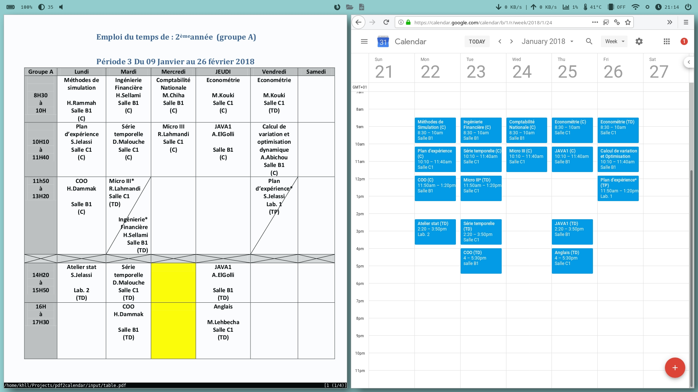

# pdf2calendar

Automatically parse a PDF timetable and add it to Google Calendar using Python OpenCV and Tesseract.



This is specific to my use case but the code can be easily repurposed to support other content layouts.

# Usage

```python pdf2calendar.py [-h] -f FILE -g GROUP -s START -e END [-t TIMEZONE]```

# Setup

1. [Turn on Google Calendar API](https://developers.google.com/calendar/quickstart/python?authuser=1)

- Use [this wizard](https://console.developers.google.com/start/api?id=calendar&authuser=1) to create or select a project in the Google Developers Console and automatically turn on the API. Click **Continue**, then **Go to credentials**.

- On the **Add credentials to your project** page, click the **Cancel** button.

- At the top of the page, select the **OAuth consent screen** tab. Select an **Email address**, enter a **Product name** if not already set, and click the **Save** button.

- Select the **Credentials** tab, click the **Create credentials** button and select **OAuth client ID**.

- Select the application type **Other**, enter the name "*pdf2calendar*", and click the **Create** button.

- Click **OK** to dismiss the resulting dialog.

- Click the **(Download JSON)** button to the right of the client ID.

- Move this file to your working directory and rename it `client_secret.json`

2. Install the required system packages listed at the `dependencies` folder

3. Place `dependencies/essai.traineddata` in your system's `tessdata` directory.

4. `pip install --user -r requirements.txt`
